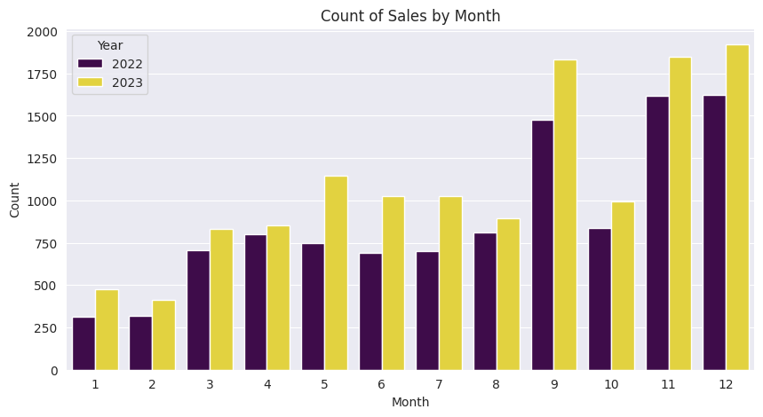
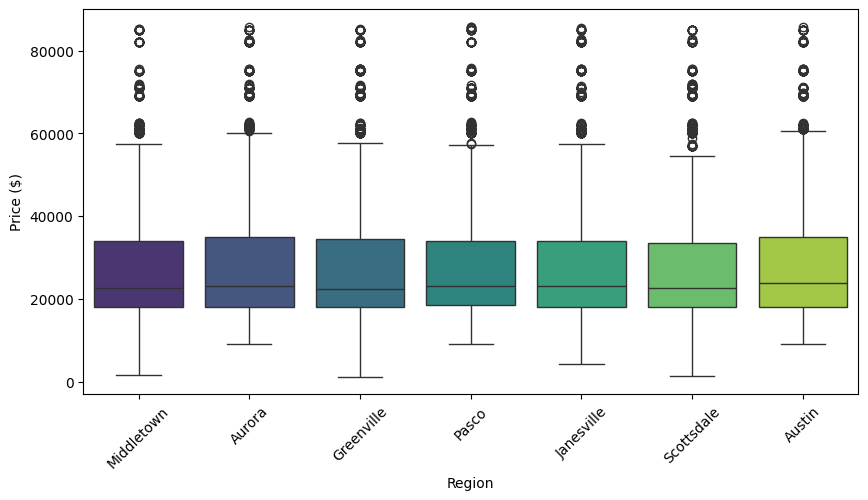
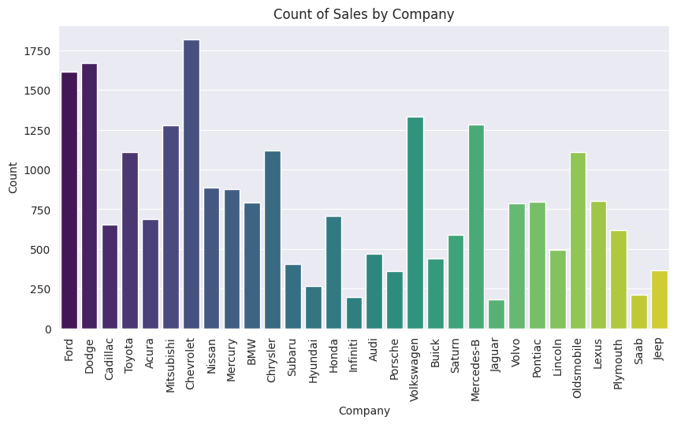
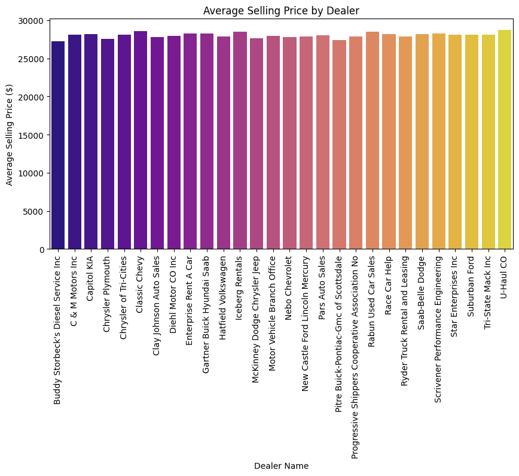

# 🚗 Car Sales Analysis & Customer Purchase Prediction


End-to-end data analysis project on a **car sales dataset (~23,900 transactions, 2022–2023)**: data cleaning, exploratory data analysis (EDA), business-question-driven visualization, and machine learning models to predict high-potential customers.

> 📓 Full analysis notebook: [Car_Sales.ipynb](Car_Sales.ipynb)

---

## 📋 Table of Contents

- [Project Overview](#-project-overview)
- [Dataset](#-dataset)
- [Workflow](#-workflow)
- [Key Insights](#-key-insights)
- [Machine Learning](#-machine-learning)
- [Model Results](#-model-results)
- [Getting Started](#-getting-started)
- [Tech Stack](#-tech-stack)

---

## 🎯 Project Overview

This project answers real business questions from raw car sales data:

- What is the **average selling price** per dealer?
- Which car **brand has the highest price variation**, and what does that say about popular price segments?
- How are prices distributed by **transmission type, region, body style, and engine**?
- How do **sales volume and revenue** trend month by month across 2022 and 2023?
- Can we **predict whether a customer is a high-potential buyer** using machine learning?

## 📊 Dataset

| | |
|---|---|
| **File** | [`Car Sales.csv`](Car%20Sales.csv) |
| **Records** | ~23,906 sales transactions |
| **Period** | January 2022 – December 2023 |
| **Features** | 16 columns |

Key columns: `Date`, `Customer Name`, `Gender`, `Annual Income`, `Dealer_Name`, `Company` (brand), `Model`, `Engine`, `Transmission`, `Color`, `Price ($)`, `Body Style`, `Dealer_Region`.

## 🔄 Workflow

```
Raw CSV ──▶ Data Cleaning ──▶ EDA & Visualization ──▶ Feature Engineering ──▶ ML Modeling ──▶ Evaluation
```

**1. Data Cleaning & Preprocessing**
- Converted `Date` from `object` to `datetime`, then extracted `Month`, `Day`, `Year`
- Converted `Dealer_No` to numeric type
- Stripped whitespace from column names
- Handled missing values (filled missing `Customer Name` with `"Unknown"`)

**2. Exploratory Data Analysis** — 11+ visualizations answering business questions with `matplotlib` & `seaborn`

**3. Machine Learning** — Built and tuned 3 classification models to identify high-income potential buyers

## 💡 Key Insights

### Sales grew strongly in 2023 vs 2022, with a clear year-end peak (Sep–Dec)



### Price distribution varies significantly across dealer regions



### Top-selling brands: Chevrolet, Dodge, Ford lead in volume



### Average selling price differs notably between dealers



## 🤖 Machine Learning

**Goal:** Predict whether a customer is a high-potential buyer (target based on annual income threshold).

- **Feature encoding:** `LabelEncoder` for categorical features (`Gender`, `Company`, `Model`, `Dealer_Region`)
- **Class imbalance:** Handled with **SMOTE** oversampling
- **Train/test split:** 80/20
- **Hyperparameter tuning:** `GridSearchCV` with 5-fold cross-validation, multi-metric scoring (accuracy, precision, recall, F1)

## 🏆 Model Results

| Model | Accuracy | Precision | Recall | F1-Score | Best Params |
|---|:---:|:---:|:---:|:---:|---|
| **Random Forest** ⭐ | **0.65** | **0.66** | 0.60 | 0.63 | `max_depth=20, n_estimators=100` |
| Logistic Regression | 0.55 | 0.54 | 0.79 | 0.64 | `C=0.01, solver='lbfgs'` |
| SVM | 0.55 | 0.54 | **0.80** | 0.64 | `C=0.1, kernel='linear'` |

> **Random Forest** achieved the best overall accuracy and precision, while **SVM/Logistic Regression** offer higher recall — a trade-off to consider depending on whether the business prioritizes catching all potential buyers (recall) or minimizing wasted marketing effort (precision).

## 🚀 Getting Started

```bash
# 1. Clone the repository
git clone https://github.com/dinhhoileo/Car_Sales_Analyst.git
cd Car_Sales_Analyst

# 2. Install dependencies
pip install -r requirements.txt

# 3. Launch the notebook
jupyter notebook Car_Sales.ipynb
```

## 🛠 Tech Stack

| Category | Tools |
|---|---|
| Language | Python 3 |
| Data Manipulation | pandas, numpy |
| Visualization | matplotlib, seaborn |
| Machine Learning | scikit-learn (Random Forest, Logistic Regression, SVM) |
| Imbalanced Data | imbalanced-learn (SMOTE) |
| Environment | Jupyter Notebook |

## 👤 Author

**Huỳnh Đình Hội**

- GitHub: [@dinhhoileo](https://github.com/dinhhoileo)

---

⭐ *If you find this project helpful, please consider giving it a star!*
